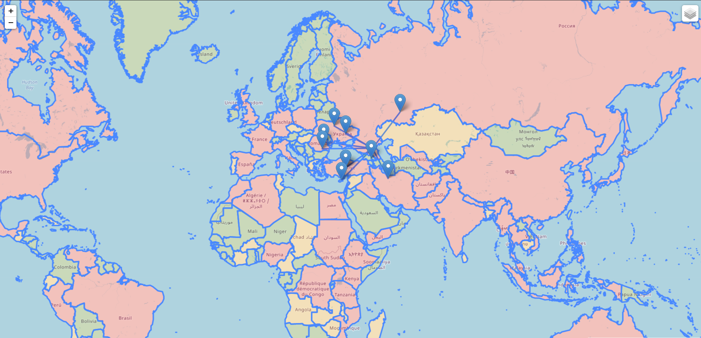

# Films_map
Short description of program

This module is made for finding ten or less nearest places of movie filming to given from user coordinates. Build a map and show those places on it.

Function description:

write_file_to_txt - writes .list file to .txt

file_prepocessing - delete unnecessary elements of each line. Return name, year, location

find_year - make list with only films of needed year

add_coords - adds coordination to film

coords_distance - calculates distance between two coordinates

find_places - return 10 or less nearest places

place_on_map - put places on map

main - input and return of program

Description of html

This is a typical html structure. Consist of next tags: Doctype, head with style with css, script with js and links, body with container div.